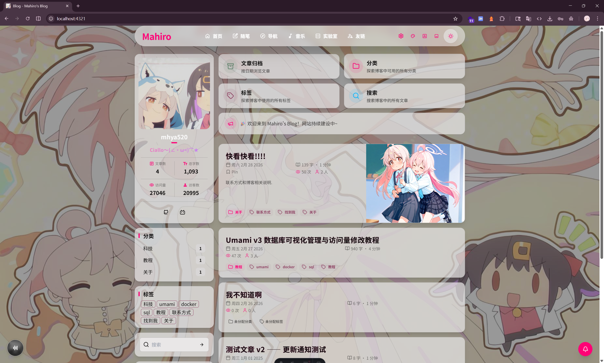
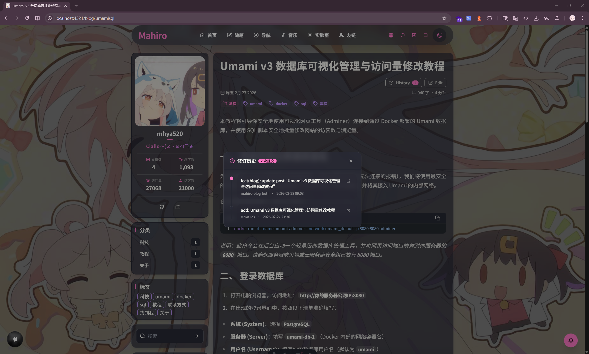
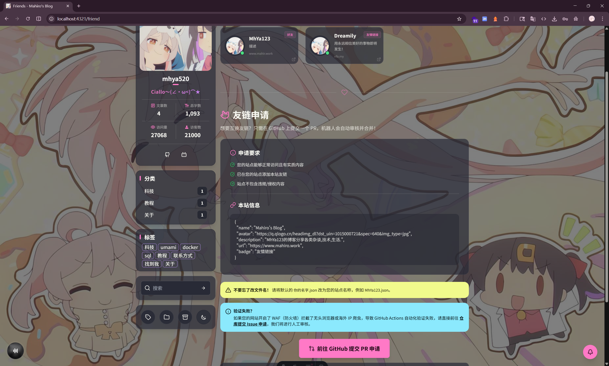

# ✨ Mahiro Blog

基于 **Astro** 构建的现代化个人博客系统。整体设计追求优雅、极简与高度可定制，在保证极致加载性能的同时，提供流畅、沉浸式的阅读体验。

> [!NOTE]
> 本项目深度融合了当前主流前端生态（React / Preact / Tailwind CSS / DaisyUI / GSAP），既完美保留了静态站点（SSG）的极速加载优势，又赋予了页面现代 Web 应用级别的无缝交互能力。

---

## 📸 界面预览

<details>
<summary>👉 点击展开/收起截图</summary>

<div align="center">


<p><em>首页 (日间/夜间模式)</em></p>


<p><em>文章详情页（包含目录与 Git Meta）</em></p>


<p><em>友链页面 (支持无人值守审核)</em></p>
</div>

</details>

> [!NOTE]
> 以上截图均基于本博客的默认配置与 DaisyUI 的内置主题生成，你可以根据自己的喜好随意定制这些视觉风格。

---

## 🌟 核心特性

* **⚡ 极速体验**：基于 Astro 混合构建模式（SSG + ViewTransitions），页面切换如丝般顺滑，首屏加载极致优化。
* **🎨 优雅主题**：深度集成 DaisyUI 主题体系，原生支持暗色模式，排版优雅且极易扩展自定义视觉风格。
* **📝 现代内容编写**：原生支持 Markdown，并完美兼容 MDX，允许在文章中无缝嵌入复杂的 React/Preact 交互组件。
* **🔍 毫秒级本地搜索**：内置基于 `pagefind` 的静态全文搜索引擎，无需额外部署后端，构建即生成，轻量且响应迅速。
* **🎵 沉浸式音乐播放**：独立开发的全局可拖拽悬浮音乐播放器，UI 高度定制，打造极客向的沉浸式阅读+聆听体验。
* **⏰ 时间脉络归档**：构建期间自动提取 Git MetaData，在文章底部精准呈现最后更新时间与 Commit 历史脉络。

> [!TIP]
> **🤖 友链全自动审核闭环**
> 本项目集成了一套完整的 GitHub Actions 自动化工作流。支持一键 PR 提交友链申请，系统将自动进行存活检测与反链校验。审核通过后自动 Squash Merge，实现**全流程无人值守**的发布体验！

---

## 🛠 技术栈概览

| 核心模块 | 技术选型 | 功能边界 |
| --- | --- | --- |
| **核心框架** | `Astro 4` 🚀 | 混合渲染、路由管理、ViewTransitions |
| **交互组件** | `React` + `Preact` | 复杂状态管理与动态 UI 渲染 |
| **样式系统** | `Tailwind CSS` + `DaisyUI` | 原子化 CSS 与现代化 UI 组件库 |
| **内容解析** | `MDX + Markdown` | 融合 Markdown 与 JSX 的内容引擎 |
| **搜索引擎** | `Pagefind` | 纯静态的 WebAssembly 搜索引擎 |
| **包管理器** | `pnpm` 📦 | 快速、节省磁盘空间的依赖管理 |

---

## 📂 项目目录结构

```text
Mahiro-Blog/
├── .github/workflows/    # 自动化工作流 (PR 自动审核、存活检测等)
├── public/               # 静态资源、图片、字体与 Favicon
├── screenshots/          # README 文档预览截图
├── scripts/              # 构建前自动执行的 Node.js 脚本 (元数据提取、WebP 转换等)
├── src/
│   ├── components/       # 公共 UI 交互组件 (Astro / React / Preact)
│   ├── content/          # 核心博客文章源文件与分类数据 (md / mdx)
│   ├── data/             # JSON 数据驱动中心 (音乐列表等配置)
│   ├── i18n/             # 多语言国际化配置与支持功能包
│   ├── integration/      # Astro 生态集成与原生特性扩展
│   ├── interface/        # Typescript 全局通用类型定义文件
│   ├── json/             # 构建时由外部脚本自动生成的极速缓存数据
│   ├── layouts/          # 全局公用的页面基础布局骨架板
│   ├── lib/              # 底层核心功能库与外部第三方接口调用库
│   ├── pages/            # 所有的前端 URL 路由渲染视图页面
│   ├── plugins/          # 自定义的 Markdown / MDX 解析增强插件
│   ├── styles/           # Tailwind 样式原子化配置与公共全局样式
│   ├── utils/            # 逻辑函数与数据格式化的纯函数工具集合
│   └── config.ts         # Astro 内容集合的 Schema 核心配置定义
├── mahiro.config.yaml    # 博客专有的超级全局配置文件 (控制站点名称、博主信息等)
├── tailwind.config.mjs   # Tailwind CSS 视觉引擎核心配置文件
├── astro.config.mjs      # Astro 框架内核与其主要集成配置文件
├── package.json          # 整体包管理与 NPM 运行脚本命令配置
└── tsconfig.json         # TypeScript 强类型编译诊断选项
```

---

## 🚀 快速开始（本地开发）

> [!IMPORTANT]
> **环境要求**：请确保您的本地开发环境已安装 **Node.js（推荐 v20 或以上版本）**，并建议全局安装 `pnpm` 以保证依赖一致性。

### 1️⃣ 安装依赖

```bash
# 克隆项目后，安装所有依赖
pnpm install

```

### 2️⃣ 构建前数据预处理 (Pre-build)

在启动本地服务或进行生产构建之前，必须先拉取和生成必要的静态缓存数据。

> [!CAUTION]
> **不要跳过此步骤！**
> 如果未执行以下预处理脚本，由于缺少必要的元数据（如音乐配置列表、Git 提交历史等），将在 SSR/SSG 构建阶段触发**致命错误**并导致进程中断。

```bash
# 获取音乐播放器数据
pnpm run prefetch:music

# 批量转换图像为 WebP 格式 (自动化优化)
pnpm run webp

# 批量为指定图片注入水印 (自动化版权保护)
pnpm run watermark
```

**预处理脚本原理解析：**

1. 🎵 **`pnpm run prefetch:music` (音乐缓存静态化)**
   * **作用**：解析您的 `mahiro.config.yaml` 中配置的网易云音乐歌单 ID。
   * **原理**：脚本会在构建前请求 API，获取歌单下所有歌曲的音频直链、歌词、封面及歌手信息，并将其转化为静态的 `src/json/music.json` 缓存文件。
   * **效果**：访客在听歌时无需再经过任何后端代理或外部 API 寻址，音频直达，实现客户端级别的 0 延迟首播。

2. ⏰ **无感自动提取 Git 历史与版本脉络** _（本地无需操作）_
   * **架构**：自研的元数据追溯机制已被深层集成进 GitHub Actions 的生产部署流水线中 (`deploy.yml`)。当您触发远端部署时，云端 CI 将自动抓取完整 Git 历史，计算全部博文的最终更新时间与总提交迭代次数。
   * **智能同步**：由于启用了云端智能同步策略（搭载 `[skip ci]` Fallback），不仅云端部署将自带最新鲜、精准的时间线和页脚版号，**该自动脚本还将把更新好的对应 JSON 数据逆向 Push 存回您的当前项目仓库中**，彻底为本地环境开发和维护免去负担。

3. 🖼️ **`pnpm run webp` (WebP 图像压缩转化)**
   * **作用**：自动扫描 `public/images/` 等目录下的传统图片格式资源 (PNG, JPG, JPEG 等)。
   * **原理**：调用底层的 `sharp` 图像压缩引擎，将传统图片批量、极速地转换为下一代轻量级 `.webp` 格式。并且，脚本具有**智能溯源能力**：在转换后，它会自动遍历 `src/content/blog/` 下的所有 Markdown 与 MDX 源文件，并无缝将旧图片的后缀引用全部替换为对应的 WebP 名，同时自动清理原始旧大图资源。
   * **增益**：极大地压缩了博客的首屏图片体积，显著提升站点的核心体验得分 (Core Web Vitals)，彻底解放人工手动转换格式和调整链接的繁杂操作。

4. ©️ **`pnpm run watermark` (智能图片水印注入与增量混淆)**
   * **作用**：为指定的公共图片添加基于半透明矢量的防伪水印（默认使用当前博客的站点配置 Domain URL），以此保护您的文章插图等创作版权。
   * **架构**：使用强大的 `sharp` 合成技术，将旋转好的 SVG 代码混入目标图片。此脚本实现了**智能哈希增量化缓存**：每次只对新增和修改过的图片注入水印，并会将源文件哈希校验值存入 `.watermark-cache.json` 中。如果您反复执行此脚本，未更改的旧图片将瞬间跳过，杜绝重复添加。
   * **整合**：已被本项目深度集成进构建生命周期，生产环境构建 (`pnpm run build`) 时将会自动串联触发本流程。

### 3️⃣ 启动开发服务器

```bash
pnpm run dev
```

> [!NOTE]
> 开发环境已刻意分离了部分构建期的元数据钩子，旨在为您提供最极致、最轻量的 HMR（热更新）开发体验。

---

## 📦 部署上线

执行 `pnpm run build` 进行生产环境构建后，所有生成的静态文件将默认输出至 `dist/` 目录。你可以将该目录下的文件轻松部署到任何支持静态页面托管的平台上。

**💡 推荐的托管平台：**

* **Vercel**：对 Astro 框架支持极佳，提供极致的零配置部署体验。
* **Cloudflare Pages**：依托强大的全球 CDN 网络，免费额度充裕且访问速度极快。
* **Netlify**：老牌且成熟的持续集成静态托管平台。
* **EdgeOne Pages**：腾讯云推出的边缘安全加速平台，适合国内网络环境优化。

> [!TIP]
> **持续部署 (CI/CD)**
> 强烈建议将你的 GitHub 仓库直接与上述平台（如 Vercel 或 Cloudflare Pages）绑定。配置完成后，每次向 `main` 分支推送代码，平台都会自动拉取并执行构建流程，实现优雅的自动化部署。

---

## 💻 二次开发与贡献

> [!IMPORTANT]
> **开源精神**
> 我们极其欢迎并鼓励你 Fork 本项目进行二次开发（二开），定制属于你自己的个性化博客！如果你在使用过程中发现了 Bug，或者有令人兴奋的新特性想法，请随时提交 Pull Request 或 Issue。

> [!TIP]
> **致谢与协议**
> 如果本项目的代码（特别是自动化友链工作流或音乐播放器部分）对你有所帮助，**我们非常希望你能在你的网站底部或关于页面中保留对本项目的致谢链接**，这也是对我们开发工作的巨大肯定。

---

## 🤝 友链申请指南 (Auto-PR)

我们非常欢迎高质量的个人博客交换友链！本站采用无人值守的自动化处理流程，只需简单几步即可完成申请：

**Step 1：添加本站链接**
请确认您的网站页面中已包含本站的超链接（需指向 `mahiro.work`）。

**Step 2：发起自动化申请**
访问我们的友链页面 👉 [mahiro.work/friend](https://www.mahiro.work/friend)，滚动至页面底部并点击 **“提交 PR 申请”**，系统将自动引导您进入 GitHub 的 `friends` 数据目录。

**Step 3：填写信息**

* 创建一个以 `您的名字.json` 命名的文件。
* 按照模板要求完善您的站点信息。

> [!WARNING]
> 如果您的网站将本站的友链放置在内页（而非主页），请务必在 JSON 中正确填写 `backlink` 字段，提供具体的反链 URL，否则将无法通过自动检测。

**Step 4：提交与合并**
提交 Pull Request 后，后端的 GitHub Actions 机器人将接管一切。它会自动执行：**网站存活检测 ➔ 反链合规校验 ➔ 自动审核 ➔ Squash Merge**。

🎉 审核通过后，最快约 **3 分钟**您的网站就会出现在本站的友链列表中！

---

## 📄 协议 (License)

本项目基于 [MIT License](https://opensource.org/licenses/MIT) 协议开源。
你可以自由地使用、修改和分发本项目的代码，但请保留原作者的版权声明。
